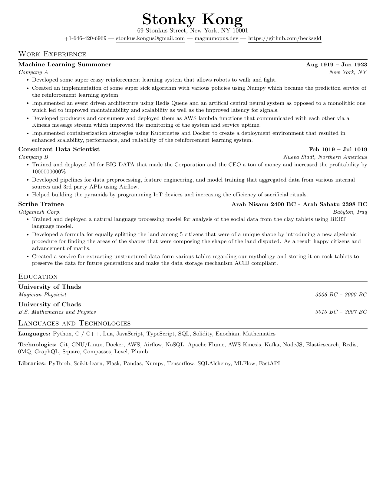

## About The Tool
A tool to create a simple and clean resume using LaTeX from a YAML file cause YAML is readable. The idea behind this tool is to be as simple and straightforward to use as possible with minimal dependencies. 

This is what the output resume looks like.



<p align="center">(<a href="#readme-top">back to top</a>)</p>


<!-- GETTING STARTED -->
## Getting Started

Follow the description below. 
### Prerequisites

This tool relies on the use of [`make`](https://www.gnu.org/software/make/) and [`pandoc`](https://pandoc.org/installing.html). So make sure you have both of them installed. 


### Installation
So simple and so clean, just do this
1. ```sh
   git clone https://github.com/becksgld/latex-cv.git
   ```
<p align="center">(<a href="#readme-top">back to top</a>)</p>

<!-- USAGE EXAMPLES -->

## Usage

1. Once you clone the repo navigate into it on your local machine
2. Edit the `cv.yaml` file with the relevant information.
3. When done simply type in your terminal `make` which will output a file `cv.pdf` that you can use.
    * Note that once you invoke `make` command it will overwrite your `cv.pdf` file so just in case back it up into the `archive` directory. 


<p align="center">(<a href="#readme-top">back to top</a>)</p>


<!-- ROADMAP -->
## Roadmap

- [ ] Add project section and templating logic for that
- [ ] Resume Versioning 
    - [ ] Automatically move previous resumes versions into the archive folder. 

See the [open issues](https://github.com/becksgld/latex-cv/issues) for a full list of proposed features (and known issues).

<p align="center">(<a href="#readme-top">back to top</a>)</p>


<!-- CONTRIBUTING -->
## Contributing

If you wanna make any changes or additions to the templating format, please fork the repo and create a pull request. You can also simply open an issue with the tag "enhancement".


<p align="center">(<a href="#readme-top">back to top</a>)</p>


<!-- LICENSE -->
## License

Distributed under the License of do whatever you want with it and have fun. 

<p align="right">(<a href="#readme-top">back to top</a>)</p>


<!-- CONTACT -->
## Contact

[BG](mailto:becks.gld@gmail.com)


<p align="center">(<a href="#readme-top">back to top</a>)</p>
